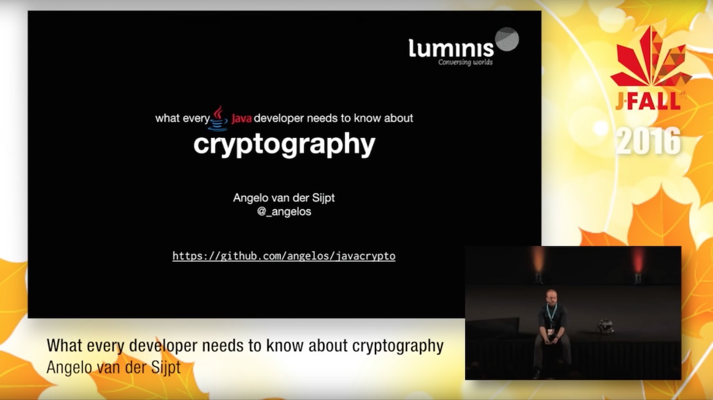

## What's this?
Supporting material for the JFall 2016 presentation "what every Java developer should know about cryptography."

Contains,

- the [presentation](whateverydeveloperneedstoknowaboutcryptography_pres.pdf),
- code examples in the [src](src) folder, for you to follow along with the the presentation,
- a [cheat sheet](whateverydeveloperneedstoknowaboutcryptography.pdf) to impress your boss and colleagues.
